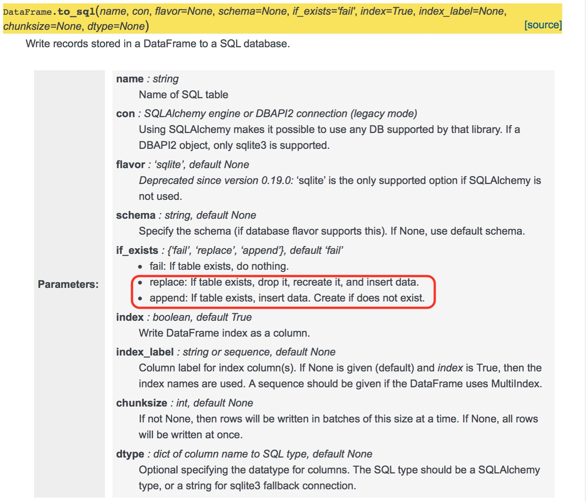

（Photo by [Nghia Le](https://unsplash.com/photos/V3DokM1NQcs?utm_source=unsplash&utm_medium=referral&utm_content=creditCopyText) on [Unsplash](https://unsplash.com/search/photos/victory?utm_source=unsplash&utm_medium=referral&utm_content=creditCopyText)）

上周五遇到pandas.DataFrame.to_sql写入Mysql数据库报错1170问题（详见：[pandas.DataFrame.to_sql写入MySQL报错1170](/2018/03/30/pandas-dataframe-to-sql-error/)），卡了我一整天；周六联系[Tushare作者米哥](https://github.com/jimmysoa)，在用户交流群里，发帖求助，米哥给了一些建议，我尝试了一下，报错依然存在；周日查[SQLAlchemy Reference](http://docs.sqlalchemy.org/en/latest/)，在想是不是哪个参数没用对，看得要吐血了还是没有眉目；晚上和一个朋友聊天，他说他现在只用PostgreSQL，完全不用MySQL......

这句话给了我灵感，我把数据库换成PostgreSQL，结果会怎样？

上午来公司，安装PostgreSQL，熟悉语法，配置完后，拿原来代码直接一跑，我靠，直接成功。PostgreSQL没有像MySQL那样，创建索引时要求TEXT类型必须指定长度，我心里暗爽，即使MySQL报错1170问题无法解决，我可以用PostgreSQL继续完成我的股票分析大业啊。

<!--more-->

接着进行后面的测试，在测试to_sql的if_exists参数时，发现了问题。这是之前的“write_records_into_mysql”函数，出错的版本。

```python
def write_records_into_mysql(df,
                             table_name,
                             conn=engine,
                             if_exists='replace',
                             dtype=None):
    
    try:
        print "*** write_records_into_mysql参数if_exists是 ***:",if_exists
        df.to_sql(table_name,
                  conn,
                  if_exists='replace',
                  dtype=None
                  )
    except Exception as e:
        print_msg(PGMname, 
                  write_records_into_mysql.func_name,
                  'error',
                  e)    
    else:
        print_msg(PGMname, 
                  write_records_into_mysql.func_name,
                  'success')
```

（封装了to_sql的write_records_into_mysql函数）

下面是调用“write_records_into_mysql”函数的主程序。

```python
            dict_k_data ={
                    'code':VARCHAR(k_data_by_code.index.
                                   get_level_values('code').str.len().max())
                }
            
            write_records_into_mysql(k_data_by_code, 
                                     'k_data',
                                     if_exists='append',
                                     dtype=dict_k_data
                                     )
```

（调用write_records_into_mysql函数的主程序）

测试中发现，在主程序中调用“write_records_into_mysql”函数时，当设置默认参数if_exists为‘append’时，写入到PostgreSQL里的数据并没有“追加”到原来的数据后面。



（panda.DataFrame.to_sql参数说明）

回头检查时，猛然发现to_sql用到的if_exists参数，不管调用时怎么给它赋值，执行时使用的永远是‘replace’，‘replace’的意思是如果库表存在，直接删除，重新创建，然后写入数据。

原来to_sql用到的dtype参数，在函数执行时，它的值一直是None，主调程序里指定dtype=dict_k_data完全没起作用。这导致MySQL引擎在给‘code’字段创建索引时，没有使用指定长度的VARCHAR类型，仍然使用变长的TEXT类型，这便是MySQL报错1170 “BLOB/TEXT column 'code' used in key specification without a key length”的原因。

将to_sql里if_exists和dtype两个默认参数，改为用变量来赋值，就没问题了，见下面正确代码。

```python
def write_records_into_mysql(df,
                             table_name,
                             conn=engine,
                             if_exists='replace',
                             dtype=None
                             ):
    
    try:
        print "*** write_records_into_mysql参数if_exists是 ***:",if_exists
        print "*** write_records_into_mysql参数dtype是 ***:",dtype
        
        df.to_sql(table_name,
                  conn,
                  if_exists=if_exists,
                  dtype=dtype,
                  )
        
    except Exception as e:
        print_msg(PGMname, 
                  write_records_into_mysql.func_name,
                  'error',
                  e)    
    else:
        print_msg(PGMname, 
                  write_records_into_mysql.func_name,
                  'success')
```

（正确的write_records_into_mysql函数版本）

被搅得心神不宁的问题，终于得到解决。我长输一口气。

为什么同样的代码，半年前没有问题，现在执行不成功呢？出错的根源是，使用“write_records_into_mysql”函数对to_sql封装后，进行函数调用时，参数指定得不对。

希望以后再也不要犯这个错误。