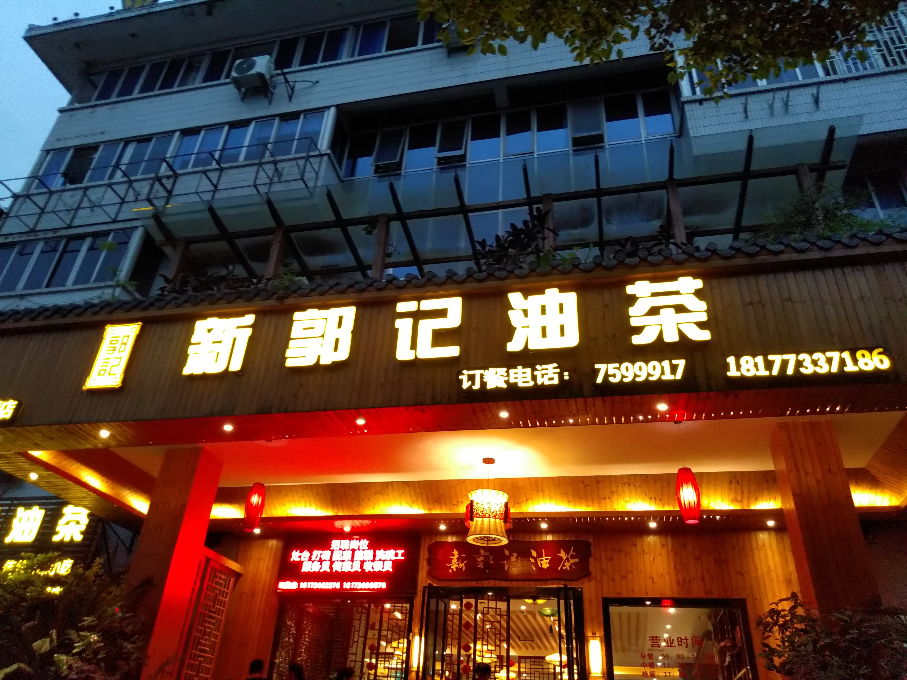
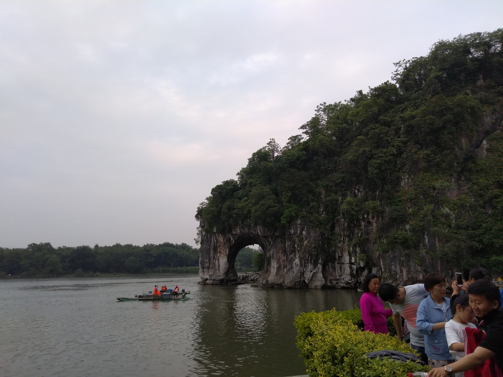
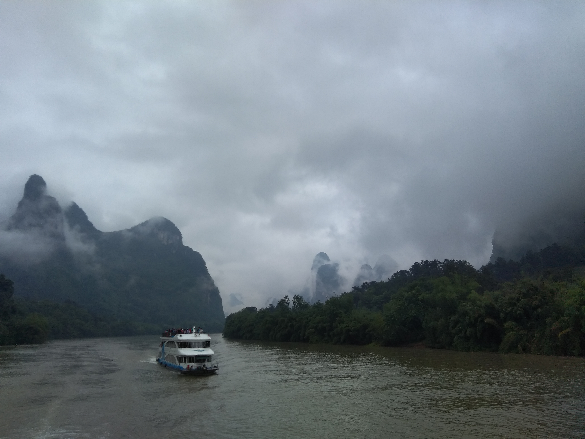
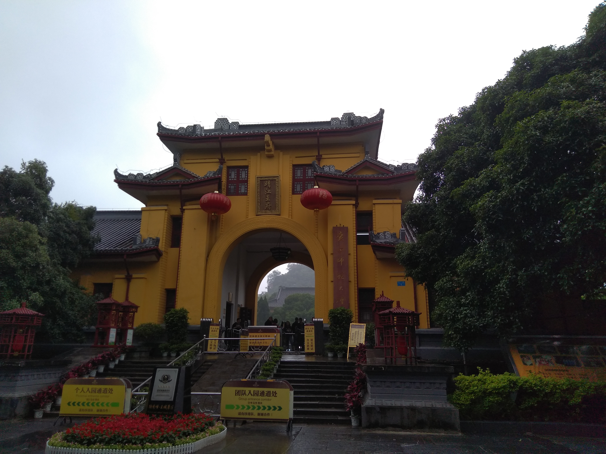
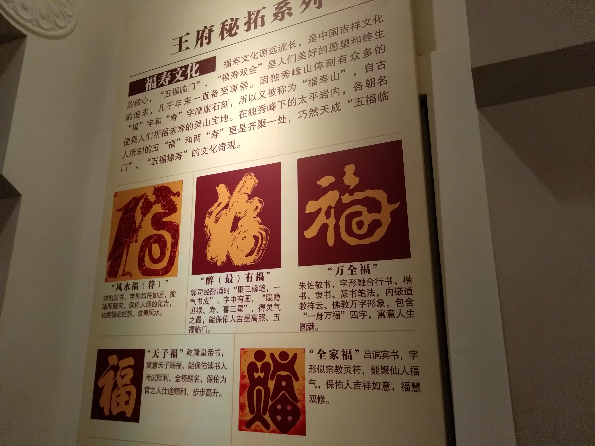
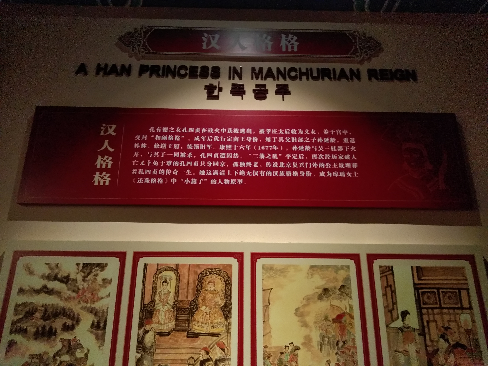

(Photo by [Joshua Earle](https://unsplash.com/photos/EqztQX9btrE?utm_source=unsplash&utm_medium=referral&utm_content=creditCopyText) on [Unsplash](https://unsplash.com/search/photos/guilin?utm_source=unsplash&utm_medium=referral&utm_content=creditCopyText))

五一去桂林玩了几天，整体感觉挺不错的，整个城市被青山绿水环绕，绿化率感觉和杭州很像。

我们四大一小，一行5个人，预订的是Airbnb的民宿，这是我第一次体验Airbnb，新鲜感还是有的，但远没有第一次使用Uber强烈，Airbnb已经出现了好多年，已经没什么稀奇了。房东是当地《桂林日报》的旅行记者，从他那里获取了不少旅游相关的信息，这确实是预订Airbnb带来的一个额外好处。他推荐了两家餐厅，"新郭纪油茶店"和"椿记烧鹅"，确实非常不错。

(图1-新郭记油茶店正脸照)

<!--more-->

------

去"新郭记油茶"吃饭的一个意外发现是，除了"桂林米粉"家喻户晓之外，"油茶"在当地也是一款非常独到、有特色的食物，当茶喝它是很苦的，加上米泡、葱花、花生米、再加上一些盐，确实非常美味。

(图2-象鼻山)

第一天旅途比较劳累，只去逛了一个象鼻山。上山下山走了一圈，没觉得有啥，回来后查百科才知道关于象鼻山有很多悠久的佛教文化和历史故事，比如供奉"菩贤菩萨"的普贤塔、天平天国时期太平军在象鼻山顶用火炮轰击桂林府的城门等。

第二天乘船游漓江逛银子岩。漓江畅游一路两岸的风景很美，可惜天气不好，下着小雨，江面上冷风阵阵，站在船顶三楼甲板上拍照，待不了多久，就得跑回去。喀斯特地貌因它的举世闻名和奇特，吸引了很多外国游客慕名前来，听说当年法（第四声）国总统带着一众保镖专门去西街《Lonely Planet》推荐的一家咖啡店去喝咖啡。

(图3-漓江上的游轮)

船行3小时，在龙头山码头下船就到了阳朔。阳朔县城不大，出租车非常少，下船后我们直奔银子岩。溶洞太壮观了，进去参观之前，无论如何我都想不到山体里面会是如此巨大的空心结构，各种钟乳石从天而降，造型奇特，很多都是经历了上万年才长成，那天人很多，我们在溶洞里走了一个半小时，才把全部景观看完。

(图4-银子岩溶洞)

在银子岩里穿行的感觉很奇妙，时常让我想起学生时代边听《Nine Million Bicycles》边看《鬼吹灯》的场景，小说里有一章写主角们为了躲避追踪，逃进一个喀斯特地形的山洞，洞内峭壁上攀爬着小型蜥蜴和毒蛇野兽......

溶洞里没有自然光，打了背景灯钟乳石才拍得这么艳丽，我时不时往洞内那些阴暗的角落偷瞄几眼，想证实一下是否真的有小说里描述的猛兽存在。

自助语音讲解器里说"溶洞里面落差最大的地方将近有50米"、"有些钟乳石现在仍然在保持生长"......

第三天去看了一下《靖江王府》。朱元璋的侄孙继承父亲的王位被封于此，因为偏安一隅，躲避战乱，保存得比较完好。

(图5-靖江王府正脸照)

导游讲解王府里面的福寿文化很有意思，一提到"福"和"寿"，估计年轻人都觉得老气，不过它倆是中国人的传统文化，谁都无法避免它。

导游讲刘伯温的风水福里朱雀和龙在争抢一支如意棒，现在解读为风水，古时象征着争夺权力；"醉有福"很有意思，右边特像一个人站在酒坛子上喝酒；"全家福"里画着有钱、有粮、有田、有妻妾和子嗣，古人的幸福美好愿望，其实现代人也一样都盼望这些。

(图6-五福图)

不知道支付宝每年搞的"集五福"活动是不是从这里汲取来的灵感。

(图7-还珠格格)

在靖江王府里看到"还珠格格"的故事，才知道她是历史上独此一位的汉人格格，确实流离颠沛、身世坎坷。

"<u>*桂林山水甲天下，玉碧罗青意可参*</u>"是南宋王正功作的诗，这首诗最高刻于王府后山独秀峰石壁上，名声也是从那儿传出来的。

Airbnb房东家里放了几本他们报社出版的书，其中一本讲改开40年老百姓生活、工作方式变化的书－《百姓记忆》写的很有意思，时间不允许，只读完了一半，等以后有空去图书馆再把它剩下的一半读完吧。