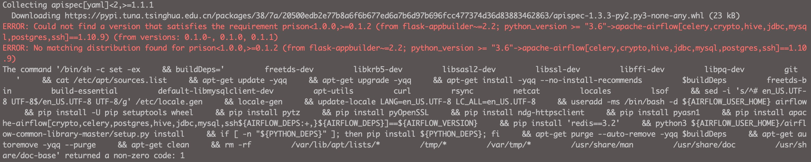
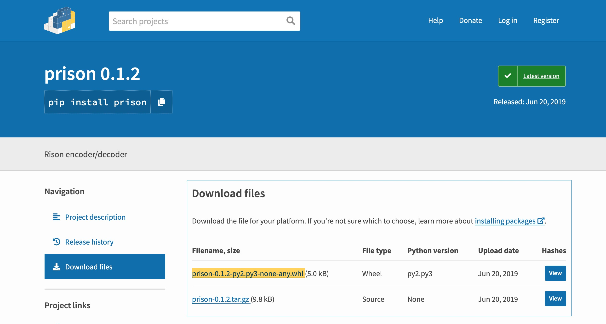
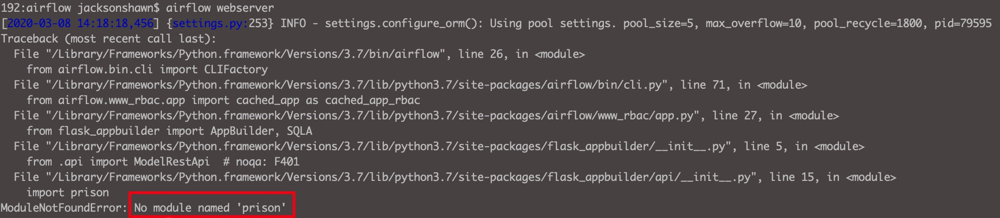
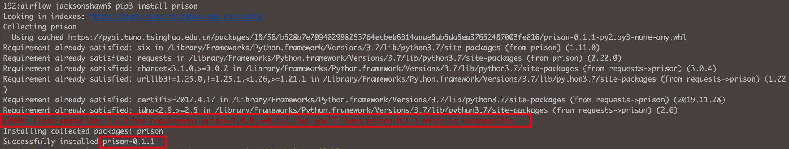
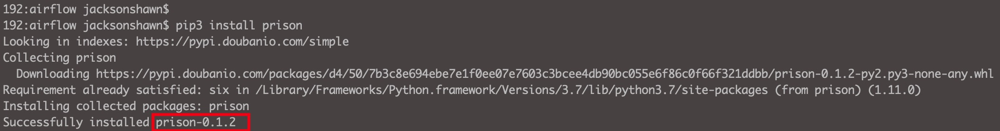
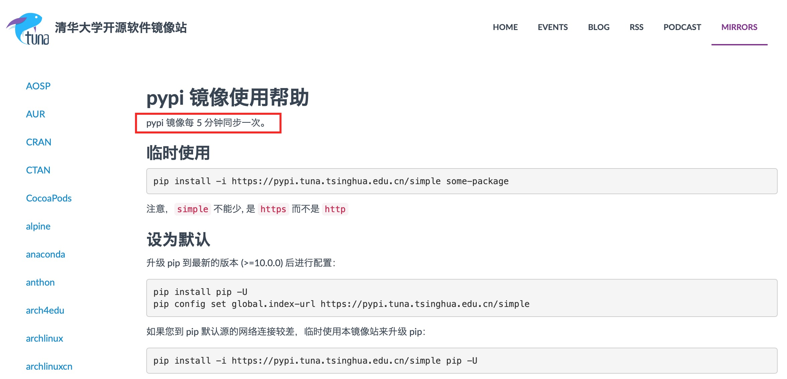
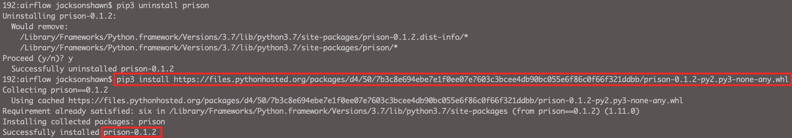

（Photo by [Iker Urteaga](https://unsplash.com/@iurte?utm_source=unsplash&utm_medium=referral&utm_content=creditCopyText) on [Unsplash](https://unsplash.com/s/photos/air-flow?utm_source=unsplash&utm_medium=referral&utm_content=creditCopyText)）


今天使用[puckel](https://github.com/puckel/docker-airflow)提供的Airflow Dockerfile镜像文件build镜像时遇到prison这个包提示如下报错。



Docker build过程中，安装flask-appbuilder包时候由于它需要依赖prison包，但pip源里prison包的版本不对，因此报错，镜像打不成功。


我用的是[清华的pip源](https://mirrors.tuna.tsinghua.edu.cn/help/pypi/)。

<!--more-->

prison这个包，查看PyPI和GitHub页面，它的最新版本是0.1.2，如果是清华镜像源的问题，我们可以使用PyPI官网提供的.whl文件进行安装。




由于我本机也安装了apache-airflow，使用`pip3 show prison`，可以看到prison版本是0.1.2，并且它被Flask-AppBuilder包依赖。

```shell
192:docker-airflow jacksonshawn$ pip3 show prison
Name: prison
Version: 0.1.2
Summary: Rison encoder/decoder
Home-page: https://github.com/betodealmeida/python-rison
Author: Beto Dealmeida
Author-email: beto@dealmeida.net
License: MIT
Location: /Library/Frameworks/Python.framework/Versions/3.7/lib/python3.7/site-packages
Requires: six
Required-by: Flask-AppBuilder
```


在安装了prison的基础上，使用`airflow webserver`命令，可以启动airflow的Web UI页面；把prison卸载掉，再使用`airflow webserver`命令，则提示如下报错，也是flask_appbuilder包提示的报错。




上面两种方法可以判断一个Python包被哪些包所依赖。


由于我本机默认使用清华的pip源，使用`pip3 install prison`安装可以看到它安装的是prison-0.1.1版本，并不是最新的prison-0.1.2版本，并且提示了ERROR信息。虽然报错，但prison-0.1.1版本还是安装成功，我试了一下`airflow webserver`能够启动成功。




将默认的pip源换成豆瓣源，卸载掉prison重新安装，可以看到这次安装了prison-0.1.2版本。




这说明，豆瓣的pip源比清华的pip源更新一些，同步得比清华勤快，心里默默给豆瓣点个赞。




我对清华pypi镜像页面上写的"**pypi 镜像每 5 分钟同步一次**"表示严重怀疑，因为前天我在打Airflow镜像时就遇到过prison版本不对的报错。


其它的Python包我就不去比较了，自此以后，无条件优先使用豆瓣源，pip源配置信息如下：

```
[global]
index-url=https://pypi.doubanio.com/simple
#index-url=https://pypi.tuna.tsinghua.edu.cn/simple
[install]
trusted-host=pypi.doubanio.com
#trusted-host=pypi.tuna.tsinghua.edu.cn/
```


我们更换pip源，是为了加快Python包的下载安装速度。如果豆瓣源也没有及时更新PyPI的数据，那我们怎么办呢？其实可以直接使用PyPI官网上的.whl文件在线安装。


[.whl文件](https://pythonwheels.com)本质也是一个Python安装包形式，它是用来取代egg安装包的，可以直接使用pip安装（对pip有一定版本要求，基本都满足）。


使用`pip3 install https://files.pythonhosted.org/packages/d4/50/7b3c8e694ebe7e1f0ee07e7603c3bcee4db90bc055e6f86c0f66f321ddbb/prison-0.1.2-py2.py3-none-any.whl`在线安装.




**参考资料**

- [清华pypi 镜像使用帮助](https://mirrors.tuna.tsinghua.edu.cn/help/pypi/)
- [Python Wheels](https://pythonwheels.com)
- [PYPI prison 0.1.2](https://pypi.org/project/prison/#files)