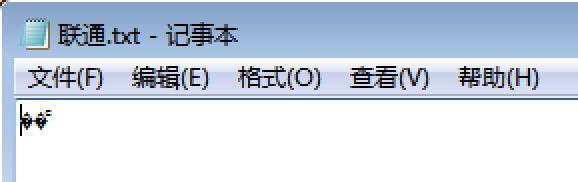

(Photo by [Markus Spiske](https://unsplash.com/photos/Skf7HxARcoc?utm_source=unsplash&utm_medium=referral&utm_content=creditCopyText) on [Unsplash](https://unsplash.com/?utm_source=unsplash&utm_medium=referral&utm_content=creditCopyText))

今天看到这篇[讲解Python字符编码](https://funhacks.net/explore-python/Basic/character_encoding.html)的文章时，我觉得需要巩固一下对字符编码这块内容的理解，深入看下去之后，挖掘出来很多新的内容。

我们都知道Python2默认使用ASCII字符编码（Python3默认使用UTF-8字符编码），因为Python2这门语言发布的时候，Unicode编码还没有诞生，见这篇文章[Python编码为什么那么蛋疼？](https://foofish.net/why-python-encoding-is-tricky.html)。在写程序过程中经常会遇到UnicodeEncodeError和UnicodeDecodeError，如果没有彻底搞懂，会让人很崩溃，每次都得额外花费时间去搜索解决办法，为什么不一次性弄懂把它刻在脑子里呢？

这篇总结，就给你提供一个一次性弄懂的机会。

<!--more-->

> Python 2.7.12 |Anaconda 2.3.0 (x86_64)| (default, Jul 2 2016, 17:43:17)
>
> [GCC 4.2.1 (Based on Apple Inc. build 5658) (LLVM build 2336.11.00)] on darwin
>
> Type "help", "copyright", "credits" or "license" for more information.
>
> Anaconda is brought to you by Continuum Analytics.
>
> Please check out:[http://continuum.io/thanks](#)and[https://anaconda.org](#)
>
> \>>> import sys
>
> \>>> sys.getdefaultencoding()
>
> 'ascii'
>
> \>>>

*（在终端使用命令查看Python2.7默认的编码方式）*

### Unicode和UTF-8转换规则

当我看完讲解Python字符编码这篇文章后，我才知道UTF（Unicode Transfer Format，通用传输格式）的作用是**定义Unicode字符存储和传输的格式。**

通过这篇文章里给出的链接，我读到了阮一峰老师2007年写的[字符编码笔记：ASCII，Unicode 和 UTF-8](http://www.ruanyifeng.com/blog/2007/10/ascii_unicode_and_utf-8.html)，写得非常好，UTF-8编码只是Unicode字符集的一种实现方式，Unicode还有UTF-16、UTF-32（基本废弃不使用）等实现形式，文中还给出了Unicode和UTF-8编码方式的转换关系，如下。

```markdown
Unicode符号范围      |  UTF-8编码方式
```

```markdown
(十六进制)           | （二进制）
--------------------+------------------------------------
0000 0000-0000 007F | 0xxxxxxx
0000 0080-0000 07FF | 110xxxxx 10xxxxxx
0000 0800-0000 FFFF | 1110xxxx 10xxxxxx 10xxxxxx
0001 0000-0010 FFFF | 11110xxx 10xxxxxx 10xxxxxx 10xxxxxx
```

*（Unicode和UTF-8编码方式的转换关系）*

当我们存储或传输字符时，存储和传输的是字符的比特流信息，不是字符本身。计算机世界最开始只用ASCII字符编码，发现ASCII不够用之后进化为UTF-16字符编码，后来UTF-16还是不够用，就进化为UTF-8字符编码。其间，各个国家都各自搞一套字符集，最终被标准化组织统一形成了Unicode字符集。尽管操作系统各不相同，但在[计算机内存中统一使用Unicode字符集](https://www.liaoxuefeng.com/wiki/0014316089557264a6b348958f449949df42a6d3a2e542c000/001431664106267f12e9bef7ee14cf6a8776a479bdec9b9000)，当需要将内存中的数据向硬盘中存储或向网络传输时，就转换为你指定的编码方式，比如UTF-8。

### 计算机内存中统一使用Unicode字符集？

我认同这个观点。

我这样理解它，比如Java语言某些数据类型使用UTF-16编码，Python2默认使用ASCII编码（当然你可以在程序开头写“# -*- coding: utf-8 —”表明使用UTF-8编码），Python3默认使用UTF-8编码，Ubuntu默认使用UTF-8编码，Win7中文版默认使用GBK编码（在GB2312上面的拓展版本）。

在这些系统或应用中定义同一个字符，尽管长度不一，但字符的Unicode字符是相同的。字符在内存中以Unicode字符定义的二进制式形式存在，虽然多字节字符在内存中有大端小端问题需要考虑（**单字节字符没有大端小端问题**），但它们可以被正确转换、识别。

### 记事本使用UTF-16编码的例子

请注意看阮一峰老师文章中举的例子，不然不太好理解Unicode和UTF-8的转换规则。在看到Python之禅指出阮一峰文章中的常识性错误后，[阮一峰对Unicode和UTF-8一些常识理解错误](https://foofish.net/unicode_utf-8.html)，我才知道Windows记事本另存为时，编码方式中的Unicode和Unicode big endian其实就是UTF-16编码方式，前者是小端存储，后者是大端存储。

内容有点多，如果没有基础，可能不大容易消化得过来，建议多看几遍，加强理解。

### 汉字的UTF-8和Unicode展现形式

我们先看一下下面这个例子。

Python2.7环境，我们Print变量a和直接显示变量a，它在终端里显示出来的内容是不一样的。直接显示变量a，打出来的是'汉'这个字的UTF-8编码格式－**'\xe6\xb1\x89'**，‘汉’这个字的Unicode编码是**u‘\u6c49’**。Unicode编码是汉字在内存中的真实存在形式，而UTF-8编码是汉字的一种显示、存储或传输形式，那怎么样由Unicode编码转换为UTF-8编码，或者怎么由UTF-8编码转换为Unicode编码呢，答案是按照上图的转换规则转变而来。

延伸阅读，[print是sys.stdout.write函数的封装形式](http://blog.csdn.net/orangleliu/article/details/42915501)。

> \>>> a = '汉'
>
> \>>> print a
>
> 汉
>
> \>>> a
>
> '\xe6\xb1\x89'
>
> \>>> u‘汉’
>
> u‘\u6c49’

### 汉字“联通”发生碰撞

了解这些后，我们继续拓展对字符编码的认知。

看一下这篇[网页编码就是那点事](http://www.qianxingzhem.com/post-1499.html)，加深你对字符编码的理解。里面提到**UTF-8和GB2312两种字符集发生碰撞**的情况。我在Win7里测试，新建一个记事本只保存“联通”两个字，关闭后再打开，确实显示的是乱码。这个字符在记事本软件采用的是ANSI编码（微软推出的一种编码格式，在中文Win7系统中，汉字等同于GB2312编码，英文等同于ASCII编码），但其二进制形式恰好吻合了UTF-8编码方式，打开时，记事本误以为这是一个UTF-8编码的文件，从而显示出乱码。

> \>>> u‘联通’
>
> u‘\u8054\u901a’
>
> \>>> u‘联通’.encode('gb2312')
>
> '\xc1\xaa\xcd\xa8'



参考资料：

- [https://funhacks.net/explore-python/Basic/character_encoding.html](#)
- [https://foofish.net/why-python-encoding-is-tricky.html](#)
- [https://foofish.net/unicode_utf-8.html](#)
- [http://www.ruanyifeng.com/blog/2007/10/ascii_unicode_and_utf-8.html](#)
- [https://www.liaoxuefeng.com/wiki/0014316089557264a6b348958f449949df42a6d3a2e542c000/001431664106267f12e9bef7ee14cf6a8776a479bdec9b9000](#)
- [http://www.qianxingzhem.com/post-1499.html](#)
- http://blog.csdn.net/orangleliu/article/details/42915501
- [http://python.jobbole.com/82107/](#)