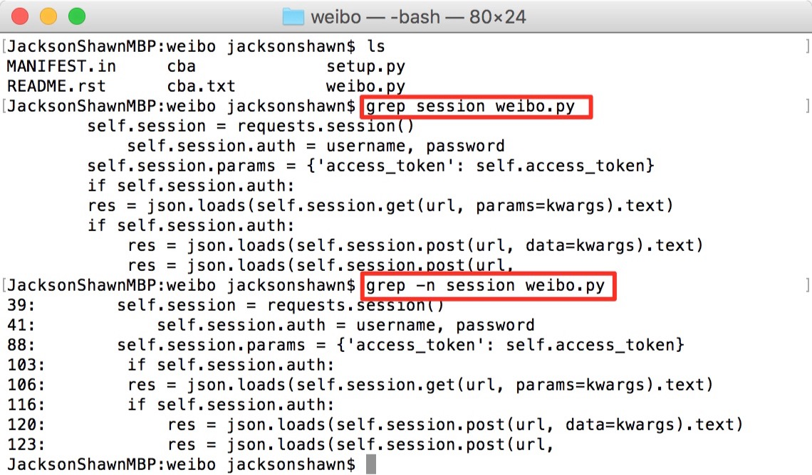
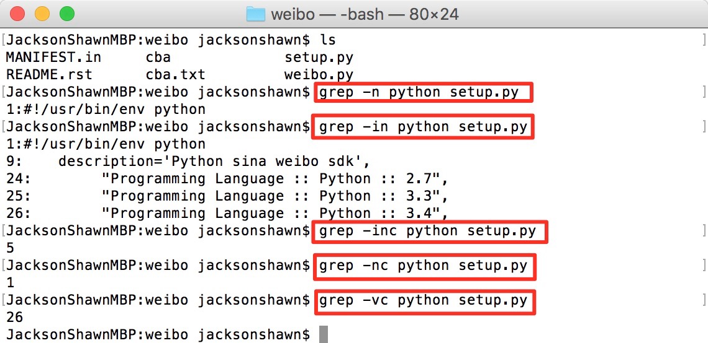
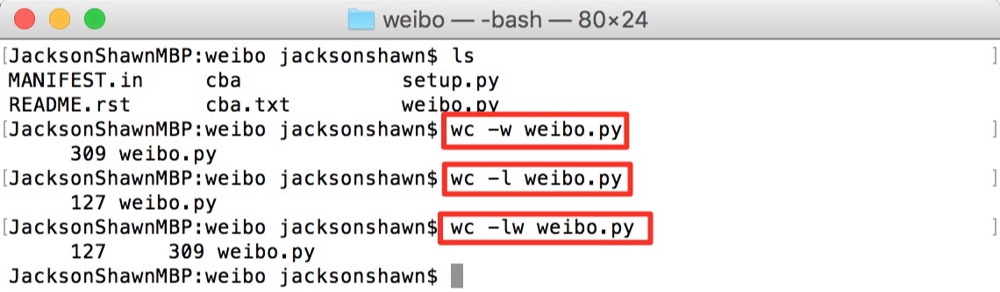
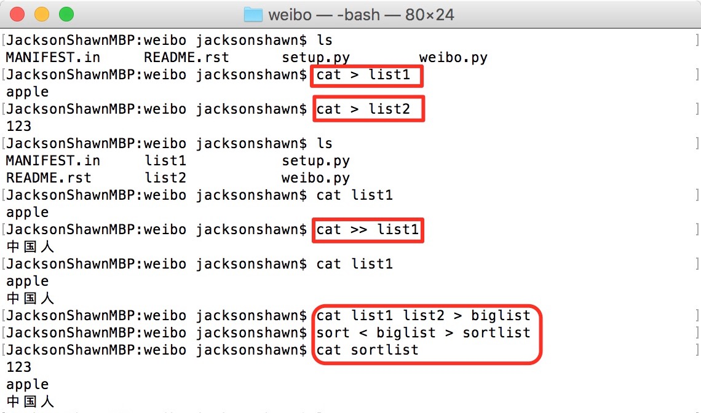
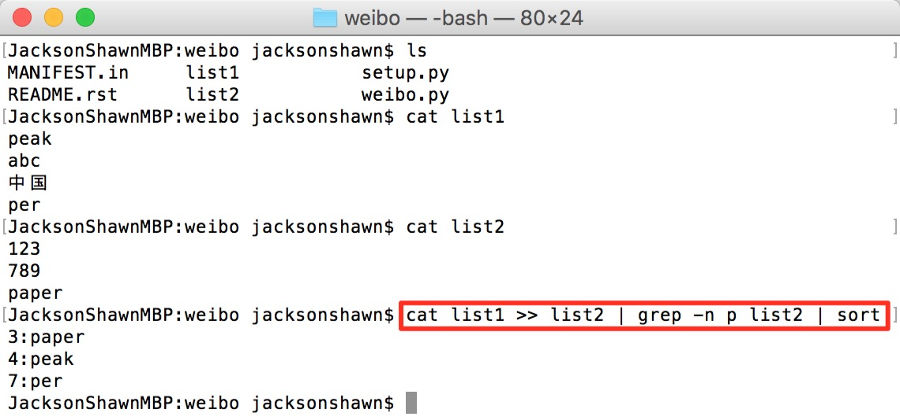

记得“李笑来”曾经说过一句话，互联网时代，大多数公司的服务都是部署在Linux上面，如果一个大学生，努力学习熟练掌握Linux命令操作，在IT行业肯定能找到一份好工作。

这两天看阮一峰老师的博客，他推荐这本“[UNIX Tutorial for Beginners](http://www.ee.surrey.ac.uk/Teaching/Unix/)”给不熟悉UNIX或Linux操作的朋友。我读了一下，刷新了很多对UNIX和Liunx命令操作的认知。下面是我为读过的章节写的笔记，都是一些我以前不曾了解或认知有误的地方。欢迎大家指正。

<!--more-->

# UNIX Introduction

Everything in UNIX is either a file or a process.

# UNIX Tutorial One

## .和..符号

在一个目录下使用mkdir创建一个文件夹，使用“ls -a”命令可以看到该文件夹下面有“.”和“..”。这两个点在UNIX里有约定俗成的含义。

> In UNIX, (**.**) means the current directory while (**..**) means the parent of the current directory.
>

UNIX文件系统是一个倒置的树状结构，如下。

如果你在文件系统里面迷失，在Shell终端任何一个位置直接输入cd，即可回到当前用户目录。这之前，我一直使用“cd ~”返回当前用户目录。

> Typing cd with no argument always returns you to your home directory.
>

## pwd命令

“pwd”命令用来查找当前目录的绝对路径，有点惭愧，现在才知道这个命令的用法。我在mac OS里经常使用两个手指单击、显示简介、复制位置的方式去获取文件夹所在路径，如果早知道这个命令，能节省多少工作量呀。

# UNIX Tutorial Two

## cat和less命令

“cat”命令可以直接在终端里查看一个文件的内容。

> The command cat can be used to display the contents of a file on the screen.
>

“cat”命令可以查看文件内容，这个我是知道的。但“cat”命令一次性将全部文件内容输出到终端，不具备翻页功能，使用起来挺不方便。

这时，你可以使用“less”命令。

> The command less writes the contents of a file onto the screen a page at a time.
>

“less”命令使用空格键进行翻页，使用字母“q”退出。通常情况下，我们优先使用“less”而不是“cat”。

此外，查看文件内容，还有“head”和“tail”命令。Pandas包里面的DataFrame文件有非常常用的两个命令就是“head”和“tail”，说不定就是参考UNIX设计的呢。

> The head command writes the first ten lines of a file to the screen.
>
> The tail command writes the last ten lines of a file to the screen.
>

但是，请注意，“cat”、“less”、“head”、“tail”都是用来查看文件内容，不是用来查看文件夹的。

## less命令查找功能

此外，在“less”命令中，还可以使用“/”加你要查找的单词进行查找，匹配到的内容会被高亮显示，使用字母“n”跳转到下一个位置。

> In less (i.e. don't press [q] to quit), type a forward slash `[/]` followed by the word to search.
>
> less finds and highlights the keyword. Type `[n]` to search for the next occurrence of the word.
>

## grep是utility，不是command

接下来是一个很重要的功能，**grep**。注意，在UNIX系统里面grep不是command，它是utility，我们就称之为功能吧，grep是一个非常强大的查找工具，可以在指定文本里查找内容。我不是非常确定，但感觉grep可能是用C语言编写的一个封装包。

grep有如下几个参数。

- -v display those lines that do NOT match

- -n precede each maching line with the line number
- -c print only the total count of matched lines
- -i ignore upper/lower case distinctions

（图1:grep操作1）

图1，在weibo.py这个文件中查找session字符，将匹配到的内容直接打印出来。加上-n参数后，显示出session

字符所在行的行号。

（图2:grep操作2）

图2，在setup.py这个文件中查找python字符，加上-n参数后，显示出python字符所在行的行号。但是加上-in参数后，显示出有5条记录，我们可以看到，参数-i忽略了大小写。如果再加上参数-c，则直接统计python字符在待查找文本中出现的次数。参数-c的优先级最高。使用-v命令则反向查找，查找不包含python字符的记录。

基本用法就是这些，自己动手操作一遍，很快就能掌握。

## wc utility

和grep一样，**wc**（word count）也是一个非常有用的utility，它的作用是统计文件中字符的个数及文件的行数。

# UNIX Tutorial Three

## UNIX重定向

在Shell终端，直接输入“cat”命令，然后回车；输入一些内容，按CTRL+D，终端会返回你输入的内容。这种操作有个专业名词叫做Redirection。

我们可以使用“>”将输出内容重定向到文件，可以使用“>>”将输出内容追加到文件，可以使用“<”从文件接收输入内容。

## 管道

使用“|”（vertical bar）符号，可以将多条命令联合在一起使用，将前一个命令的输出作为后一个命令的输入，这个就是管道干的事情。如下图，将三条命令结合在一起使用，非常形象地演示了管道的作用。

# [UNIX Tutorial Five](http://www.ee.surrey.ac.uk/Teaching/Unix/unix5.html)

## 文件权限

使用“ls -l”可以查看文件夹或文件的权限。

第一个字符d表示这是一个目录，即文件夹；如果是一个dash（中划线），表示是一个文件；

第二到第四个字符表示**创建者对这个文件夹或文件所拥有的权限**。“rwx”分别表示read、write、execute。三个连在一起，意思是创建者对file1这个文件夹或文件，拥有读、写（包括修改和删除）、执行全部权限，这是最高级别的权限。

第五到第七个字符表示这个**创建者所属群组对这个文件夹或文件所拥有的权限**。Linux和我们熟悉的Windows不一样，它设计的安全权限标准比Windows高。我们被Windows驯化成习惯一个用户全局操作磁盘上所有文件，初来乍到的Linux新手，很容易被这些复杂的组权限搞蒙。这里“rw-”表示具备读、写权限，不具备执行权限。

第八到第十个字符表示**其它群组对这个文件夹或文件所拥有的权限**。“r--”表示只有读权限，没有写和执行权限。

但是！！！我们一定要注意，UNIX系统中，对待文件和文件夹，“rwx”表示的具体含义是有区别的，如下。

### Access rights on files

- r (or -), indicates read permission (or otherwise), that is, the presence or absence of permission to read and copy the file 
- w (or -), indicates write permission (or otherwise), that is, the permission (or otherwise) to change a file 
- x (or -), indicates execution permission (or otherwise), that is, the permission to execute a file, where appropriate 

### Access rights on directories

- r allows users to list files in the directory; 
- w means that users may delete files from the directory or move files into it; 
- x means the right to access files in the directory. This implies that you may read files in the directory provided you have read permission on the individual files. 

“r”权限，对文件来说，就是可以打开或者复制；但对于文件夹来说，它的意思是可以使用“l”命令列出文件夹内容。

“w”权限，对文件来说，是可以写入或删除；对于文件夹来说，是可以删除里面的文件或向里面写入文件。

“x”权限，对文件来说，是可以执行这个文件；对于文件夹来说，是可以进入这个文件夹。

这样直白翻译，效果不大好。大家还是直接看原文吧。

单独搞懂“rwx”里面每一个不难理解，但经常在于文件夹权限和文件夹里面的文件权限存在互斥，这种情况可能就比较绕。

比如，你想读文件夹里面的一个文件，即使这个文件具备“r”权限，但如果它的上层文件夹或之上的任何一层文件夹不具备“x”权限的话，这个文件你仍然打不开。

mac OS处理文件权限会灵活一些，Ubuntu的权限管理则比较死板，不小心使用chmod改错权限，很容易搞出问题。

# UNIX Tutorial Six

## df命令查看磁盘空间

> The df command reports on the space left on the file system.

使用“df .”和“df -h”都可以查看磁盘空间，但后者可读性更强。

## du命令查看当前目录空间

> The du command outputs the number of kilobyes used by each subdirectory.

“du -d 1 -h”命令查看当前目录下所有文件夹的大小，-d指深度，后面必须加一个数值，－h表示适合人类阅读的。

## gzip压缩文件为.gz格式

## gunzip将.gz文件解压缩

## history命令查看终端操作历史记录

在C shell终端，使用“!”符号加参数，可以直接调用对应历史命令。

> If you are using the C shell, you can use the exclamation character (!) to recall commands easily.
>
> % !! (recall last command)
>
> % !-3 (recall third most recent command) 
>
> % !5 (recall 5th command in list) 
>
> % !grep (recall last command starting with grep)

（未完待续）