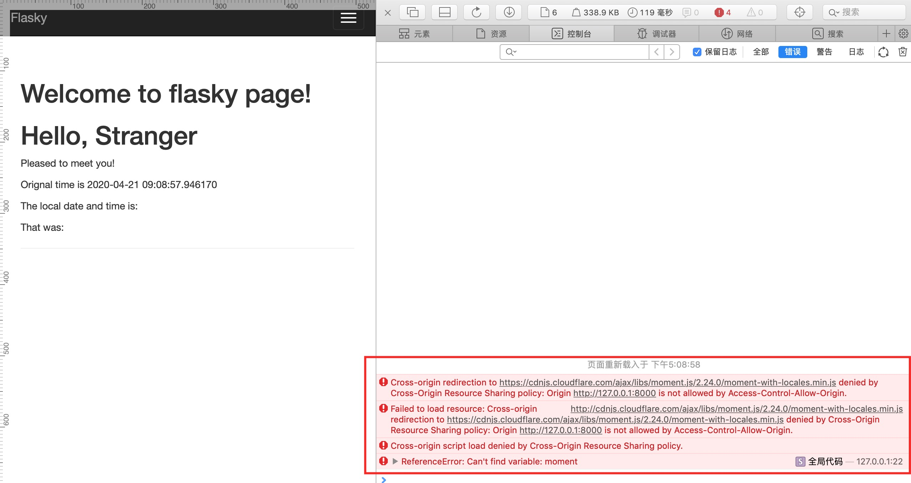

最近两次遇到跨域问题。

### Safari浏览器默认设置跨域

第一个是运行Flask程序时，本地应用请求远程CDN服务器上的js脚本时，出现了跨域导致资源访问不成功，预期js脚本没有执行。

奇怪的是在Chrome里打开应用，不报错；在Safari里打开则存在跨域，如下所示。


（图1-Chrome打开不报错，moment-with-locales.min.js获取成功）

<!--more-->


（图2-Safari打开报错，moment-with-locales.min.js无法获取）



（图3-Safari提示跨域报错）

既然Chrome里能够执行成功，说明服务器端针对CORS配置是没有问题的；问题应该是出在浏览器的特性上，搜了一圈答案后，最后发现是Safari浏览器默认设置的问题，进行如下设置即可解决这个问题。


#### Safari关闭"跨源限制"方法

Safari关闭"跨源限制"方法：

> 打开Safari开发者模式，将"停用跨源限制"功能关闭，再用Safari打开就不会出现这个问题。


### doXHR请求本地文件跨域

第二次是在Bootstrap里面测试Less代码时，遇到了跨域。

这个Bootstrap代码非常简单，一个`testless.less`文件，里面使用Less语法定义了两个HTML元素的样式。

```less
@color: #4d926F;

#header {
    color: @color;
}

h2 {
    color: @color;
}
```

一个`testless.html`文件，引用`testless.less`这个样式文件，测试Less语法是否被执行成功，如果执行成功，`h2`标签里面的文本会被渲染为绿色。

```html
<!DOCTYPE html>
<html lang="en">
<head>
    <meta charset="UTF-8">
    <meta name="viewport" content="width=device-width, initial-scale=1.0">
    <link rel="stylesheet/less" type="text/css" href="testless.less">
    <script src="dist/js/less-3.11.1.min.js"></script>
    <!-- <script src="https://cdnjs.cloudflare.com/ajax/libs/less.js/3.11.1/less.min.js" ></script> -->
    <!-- <script src="https://cdn.bootcss.com/less.js/3.11.1/less.min.js"></script> -->
    <title>Test less语法</title>
</head>
<body>
    <h2>测试Less</h2>
    <p>上面Less语法被更新为绿色</p>
</body>
</html>
```

为了确保不是本地`less.min.js`代码的问题，使用了好几个在线脚本，都是一样的结果。下面分别是在Chrome和Safari里执行的结果，不输出任何内容。


（图4-Chrome提示无法访问）


（图5-Safari提示得更清楚CORS请求只支持HTTP）

分析出错原因，`less.min.js`里面doXHR这个函数需要访问本地文件`testless.less`，CORS的安全策略不允许XHR直接读取本地文件，合适的方法是将这个要访问的文件部署到后端服务或直接放在远程服务器上，通过HTTP请求去读取。

我没有采取这两种方法。


#### Chrome关闭安全策略避免CORS问题

在StackOverflow里看到提示说，在OSX终端里使用`open -a Google\ Chrome --args --disable-web-security --user-data-dir`打开一个关掉安全策略的Chrome浏览器，就可以避免CORS问题。


我试了一下，确实可以。


(图6-Less语法执行成功)


这样虽可行，但毕竟很麻烦，每次都需要另外打开一个终端执行命令。能不能直接在VSCode里面使用Debugger for Chrome直接开启一个关闭安全策略的页面呢？


#### VS Code配置runtimeArgs参数避免CORS问题

翻了一下[VS Code Debugger for Chrome](https://github.com/Microsoft/vscode-chrome-debug)使用文档后，发现有一个`runtimeArgs`参数，或许可以用它将关闭安全策略的参数传过去，在当前项目的`.vscode/launch.json`里加上最后一行参数，测试了一下，发现结果符合预期。

```json
{
 // Use IntelliSense to learn about possible attributes.
 // Hover to view descriptions of existing attributes.
 // For more information, visit: https://go.microsoft.com/fwlink/?linkid=830387
 "version": "0.2.0",
 "configurations": [
     {
         "type": "chrome",
         "request": "launch",
         "name": "Launch Chrome against localhost",
         // "url": "http://localhost:8080",
         "webRoot": "${workspaceFolder}",
         "file": "${file}",
         "runtimeArgs": ["--disable-web-security", "--user-data-dir"],
     }
 ]
}
```


上述源代码我放在[Python-flask-cors](https://github.com/benbendemo/learning-python/tree/master/python-flask-cors/flask-cors)这个仓库里面了，感兴趣可以自己下载测试。


**参考资料**

- [About CORS](https://enable-cors.org/index.html)
- [九种跨域方式实现原理（完整版）](https://juejin.im/post/5c23993de51d457b8c1f4ee1)