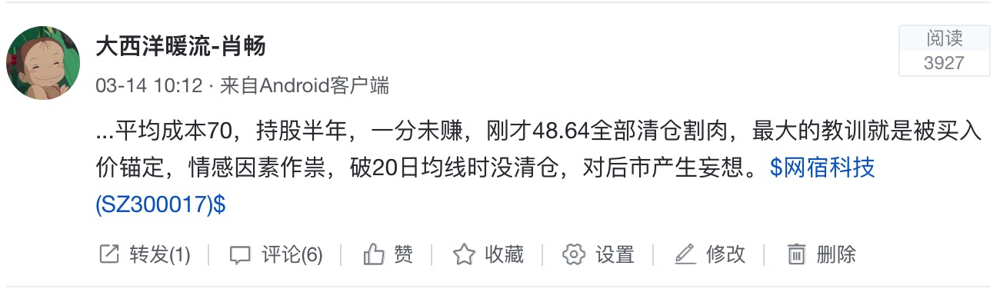

(Photo by [Mickael Gresset](https://unsplash.com/photos/X6dt5XAi6mg?utm_source=unsplash&utm_medium=referral&utm_content=creditCopyText) on [Unsplash](https://unsplash.com/?utm_source=unsplash&utm_medium=referral&utm_content=creditCopyText))

2017年就快过去，今天心血来潮，打开股票账户，统计了入市至今所有银证转帐流水记录，算了一下炒股3年到底赚了多少钱，结果让我大吃一惊。

花了一个小时把以往的记录复盘了一下，有感而发，把这3年炒股的收益情况做一个总结。

2014年年底开户入市，到今天整整3年，A股投入8.4万人民币，美股投入1000美金，总计9万人民币。流水记录显示我的资金虽然经常进进出出，但这3年间没有新增任何投入，炒来炒去就这9万块钱。整个3年，来回买卖操作的股票，大概有小100只左右，赚小钱的操作占多数，亏大钱操作占少数，但亏钱的金额远大于赚钱的金额，整体上比较悲剧，前两年一直处于净亏损状态，2017年才稍微有一些起色。

#### 股票亏钱和赚钱的股票

##### 亏钱较多的股票，印象有这么几只。

> 1、2015年上半年买视觉中国亏损近50%
>
> 2、2015年上半年买亚太集团亏损30%+
>
> 3、2017年上半年买网宿科技亏损30％+

##### 赚钱多的股票有这么几只。

> 1、2016年年中买游族网络，赚了大概2万块钱。
>
> 2、2017年年初中签一只新股，康泰药业，赚了1.5万块。
>
> 3、2017年下旬持仓至今的一只芯片股，浮盈2万左右。

有意思的是，亏钱和赚钱的股票，都是来自雪球上各色大V的推荐。

<!--more-->

#### 股票亏钱换来的经验教训

这几只大亏的股票操作下来，收获了哪些经验教训呢？

> 1、视觉中国做的是在线图片版权的生意，公司稀缺性强，在一众A股公司里面算比较独特的品种，当初买它是看到它中标国家旅游局的项目。70块买入时，它的PE在200倍左右，那时纯粹是韭菜，买了一个大顶，判断不出来这个行业的成长空间和市场规模，理论上如果一个互联网行业很赚钱，BAT应该会进入或者涉足，但好像一直没有看到此类相关的消息报道，你经常看的网易新闻、微信新闻，图片上几乎都能看到这家公司的水印，那市占率这么高，这个公司怎么还无法释放利润出来？可能不是一个好赚钱的行业。
>
> 2、亚泰集团亏钱后，从此后再也不碰东北以及经济不发达地区的股票。后来知识面广了之后才知道东北的整体经济形势是很糟糕的，经济下行的地区能走出业绩上行的公司吗，估计够呛，何况亚泰集团是典型的水泥建材股，大股东还是当地国资委。设想如果这只水泥建材股是在深圳，那它的规模或者业绩或许完全不会是这个层次，因为珠三角的经济活跃，对各类上市公司基本都是有正面效应的；从这只股票以后，我基本都只买发达地区的上市公司。
>
> 3、网宿科技的业绩拐点从BAT进入CDN领域开始显现，BAT进来搅局后，网宿科技的营收和净利润都产生了巨大的下滑，以前躺着赚钱的好日子一去不复还。当时无法认清行业局势，而且也不懂技术指标，破20日线时没及时清仓，是这次操作最失败的地方。
>

（网宿科技操作截图）

亏钱之后，我读了很多分析上市公司财报和企业估值方面的书，有一些心得和收获，提升了很多财务分析方面的知识，但还是做不到凭借自己的知识体系去独立分析和选股，好在雪球是一个高手辈出的社区，有很多高水平的球友在里面一起分析上市公司，别人的分析可以极大补充自己的短板和认知，赚钱的几只股票恰好赶上运气好，买入点比较低，算是在雪球混了3年额外得到的收获。

#### 炒股三年最终盈利结果

最终整体算下来，截止今天收盘，股票账户浮盈（盈利未卖出变现视为浮盈，不算真正赚到钱）4000块钱。也就是说投入8.4万，炒了整整3年股，只赚到4000块钱，3年的收益率4.76%，年化我就不算了，算出来丢死人。假设这8.4万存入银行，稳定吃利息，按照每年3％的单利计算，3年利息收入有7560元；假如这8.4万买基金，收益肯定会更高。

无力吐槽......

从钱的角度讲，炒3年股只赚到4000块钱，是非常不划算的，远不如买基金收益高。但鉴于我是一个新出炉的小散，没亏钱算不错了，更大的收获在于下面这几点。

#### 炒股三年主要的收获在这些方面

> 1、亏钱后，为了提升水平，零零散散读过几十本财经类书籍、在可汗学院上完整地学过估值分析课程，能分析财务结构简单的上市公司，建立了初步的模型分析框架。
>
> 2、混了3年雪球论坛，极大丰富了个人对股票、对上市公司的认知，破除了很多错误、有害的投资观念，建立了很多终身受益的投资观念。拿网宿科技来打比方，BAT进场搅局CDN行业，导致公司业绩拐点来临，营收江河日下，能判断出这种大的行业趋势，可能比能读懂财报要重要得多。
>
> 3、极大丰富了一个IT男对商业世界和经济社会的认知。炒股确实可以扩大一个人的眼界、提升一个人的财商。（当然，那种天天数K线追涨杀跌的门派，不在我表述的范围内）我的财经知识，几乎都是从雪球上学来，可以说一句不夸张的话，“在中国，学投资最好的地方就是雪球”。
>
> 4、完整经历一轮股灾，刚入市就赶上暴跌，幸好本金不多，对新人来说，其实是非常好的入市时机。

今年在美股里取得一些收益后，我对美股的价值有了全新的认识，估计今后很多年，我都会把精力投入在美股里，毕竟，炒股要对自己负责，一切以结果说话，作为小散，依然走在精进股票投资的路上。
